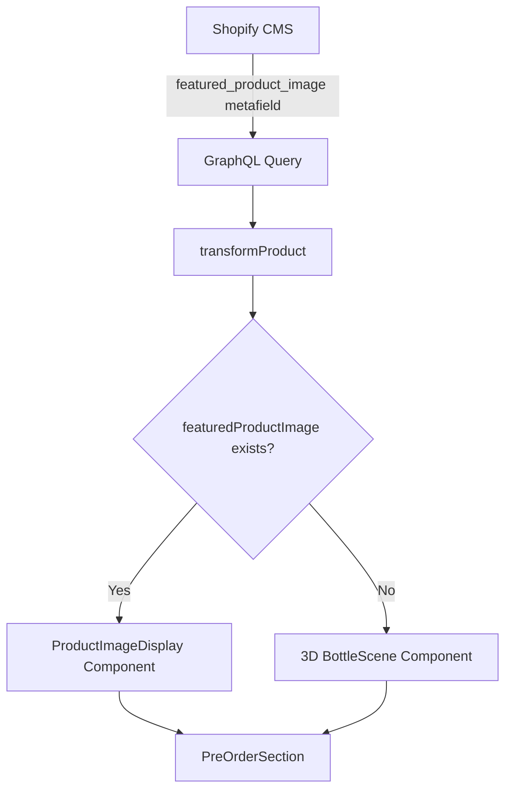

# Pre-Order Section: 3D Model vs Featured Image Toggle

## Approach

Use image presence as the toggle mechanism:

- **Image uploaded** = Display styled product image
- **No image** = Display 3D model (fallback)

This is clean UX for the client - no extra toggle field needed.

## Architecture




## Files to Modify

### 1. Add Metafield to GraphQL Query

`[lib/shopify/queries.ts](lib/shopify/queries.ts)`

Add `featured_product_image` to the metafields array:

```graphql
{ namespace: "custom", key: "featured_product_image" }
```

### 2. Update ProductData Type

`[types/content.ts](types/content.ts)`

Add new optional field:

```typescript
featuredProductImage: ProductImage | null;
```

### 3. Update Transformer

`[lib/shopify/transformers.ts](lib/shopify/transformers.ts)`

Extract the new metafield image:

```typescript
const featuredProductImage = getMetafieldImage(metafields, 'featured_product_image');
```

### 4. Create ProductImageDisplay Component

New file: `[components/ProductImageDisplay.tsx](components/ProductImageDisplay.tsx)`

A styled component that displays the product image with:

- Soft radial glow behind the image (works with black background)
- Subtle floating animation (matches 3D model feel)
- Semi-transparent frame/border for polish
- Optional drop shadow for depth
- Handles images with white backgrounds gracefully

Design approach for black background compatibility:

- Use a soft rose/gold radial gradient glow behind the image
- Add subtle box shadow with warm tones
- Include a thin decorative border or frame effect
- Apply the same hover interaction as the 3D canvas

### 5. Update PreOrderSection

`[components/PreOrderSection.tsx](components/PreOrderSection.tsx)`

Conditionally render based on `featuredProductImage`:

```tsx
{product.featuredProductImage ? (
  <ProductImageDisplay 
    image={product.featuredProductImage} 
    isHovered={isHovered} 
  />
) : (
  <Canvas ...>
    <BottleScene isHovered={isHovered} />
  </Canvas>
)}
```

## Shopify CMS Setup (Client Instructions)

The client will need to create a metafield in Shopify:

- **Namespace**: `custom`
- **Key**: `featured_product_image`  
- **Type**: `file` (image)

Then on any product, they can upload an image to this field to switch from 3D to image mode.