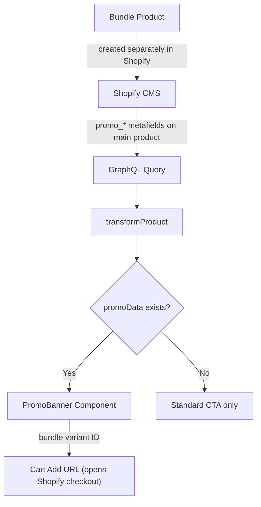

# Buy 2, Get Travel Companion Free -- Promo Banner

## Approach

Follow the same "image presence = toggle" pattern we used for the featured product image:

- **Promo image uploaded + headline set** = Promo banner visible
- **No promo image** = Promo hidden, standard single-bottle CTA only

The promo links to a **separate bundle product** in Shopify. The client stores the bundle's variant ID in a metafield so the CTA can construct a direct cart-add URL.

## Data Flow




## Shopify CMS Setup (Client Instructions)

**Step 1**: Create the bundle product in Shopify (e.g. "Love Le Nouveau -- Duo + Travel Set") with appropriate pricing. Note its variant ID.

**Step 2**: Add these metafields to the **main product** (namespace: `custom`):

- `promo_image` -- type: `file` (image) -- photo of the travel companion bottle
- `promo_headline` -- type: `single_line_text` -- e.g. "Buy 2, Get a Travel Companion Free"
- `promo_description` -- type: `multi_line_text` -- optional detail text
- `promo_badge_text` -- type: `single_line_text` -- e.g. "BEST VALUE" or "LIMITED OFFER"
- `promo_cta_text` -- type: `single_line_text` -- e.g. "Claim the Duo Set"
- `promo_bundle_variant_id` -- type: `single_line_text` -- the numeric Shopify variant ID of the bundle product
- `promo_bundle_price` -- type: `single_line_text` -- bundle price to display (e.g. "370.00")

**To disable**: just remove the `promo_image`. No image = no promo.

## Files to Modify

### 1. `types/content.ts` -- Add PromoData type

New interface:

```typescript
export interface PromoData {
  image: ProductImage;
  headline: string;
  description: string | null;
  badgeText: string | null;
  ctaText: string;
  bundleVariantId: string;
  bundlePrice: string | null;
}
```

Add to `ProductData`:

```typescript
promo: PromoData | null;
```

### 2. `lib/shopify/queries.ts` -- Add promo metafield identifiers

Add 7 new entries to `PRODUCT_METAFIELDS_FRAGMENT`:

```graphql
{ namespace: "custom", key: "promo_image" }
{ namespace: "custom", key: "promo_headline" }
{ namespace: "custom", key: "promo_description" }
{ namespace: "custom", key: "promo_badge_text" }
{ namespace: "custom", key: "promo_cta_text" }
{ namespace: "custom", key: "promo_bundle_variant_id" }
{ namespace: "custom", key: "promo_bundle_price" }
```

### 3. `lib/shopify/transformers.ts` -- Extract promo data

Add a helper function `extractPromoData` that reads the promo metafields and returns `PromoData | null`. Returns null if `promo_image` is missing (the toggle). Add `promo` to the return object of `transformProduct`.

### 4. `components/PromoBanner.tsx` -- New component

A visually distinct promotional card that renders inside the PreOrderSection product info column. Design:

- Positioned between the features grid and the main CTA button
- Contains the travel bottle image on the left, promo text + CTA on the right
- Warm rose/gold border with subtle glow to match the brand
- Optional badge pill (e.g. "BEST VALUE") in the corner
- Separate "Claim the Duo Set" CTA button (styled as an outline/secondary variant to differentiate from the main solid CTA)
- The travel bottle image gets a small glow treatment for polish on the black background
- Responsive: stacks vertically on mobile

The CTA constructs a cart-add URL using the `promo_bundle_variant_id` metafield and the `VITE_SHOPIFY_STORE_DOMAIN` env var, same pattern as the existing `PreOrderActions` component.

### 5. `components/PreOrderSection.tsx` -- Insert PromoBanner

Add conditional rendering of `PromoBanner` between `PreOrderFeatures` and `PreOrderActions` in the product info column:

```tsx
{product.promo && (
  <PromoBanner promo={product.promo} />
)}
```

### 6. `components/index.ts` -- Export PromoBanner

### 7. `types/content.ts` -- Update DEFAULT_PRODUCT_DATA

Add `promo: null` to the default fallback data.